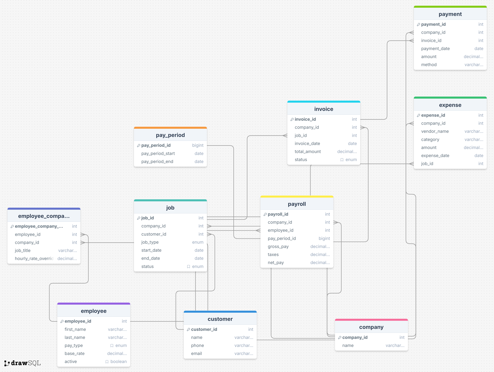

# AI-SQLite-Chatbot

A Python command-line tool that allows you to ask natural language questions about a SQLite database. The tool uses OpenAI's API to convert questions to SQL queries, executes them, and formats the results into natural language responses.

## Prerequisites

- Python 3.7 or higher
- OpenAI API key

## Installation

1. Clone the repository:

```bash
git clone https://github.com/CalebC48/AI-SQLite-Chatbot.git
cd AI-SQLite-Chatbot
```

2. Install dependencies:

```bash
pip install -r requirements.txt
```

## Configuration

You can configure the API key using either a `.env` file (recommended) or environment variables.

### Option 1: Using a .env file

1. Create a `.env` file in the project root:

```bash
OPENAI_API_KEY=your-api-key-here
OPENAI_ORG_ID=your-org-id-here  # Optional
```

2. The `.env` file is automatically loaded when you run the script.

### Option 2: Environment Variables

You can also set environment variables directly in the console. This will depend on your OS.

**Note:** Environment variables take precedence over `.env` file values if both are set.

## Usage

### Start Interactive Session

Simply run the script to start an interactive chat session:

```bash
python main.py
```

You'll see a welcome message and can then type questions. The session continues until you type `exit`, `quit`, or `q`.

### Specify Database

```bash
python main.py -d path/to/database.db
```

### Commands

Once in the interactive session:

- Type your question and press Enter
- Type `help` or `?` for help
- Type `exit`, `quit`, or `q` to exit
- Press `Ctrl+C` to exit
- Type `debug` to toggle SQL query and result visibility

## Default Database

The default database provided (`centralglass_recon.sqlite`) is built to manage employees and jobs between two small businesses owned by my Dad. The database allows you to query overall profits and expenses, as well as how much is linked to each business. There are some employees that overlap between the two companies as well.

### Database Schema (ERD)



## Examples

### Good and poor example

#### Example 1: Successful Query

**Question:** "What company has the most expenses? Which company and how much?"

**Generated SQL:**

```sql
SELECT c.name, SUM(e.amount) as total_expenses
FROM expense e
JOIN company c ON e.company_id = c.company_id
GROUP BY c.company_id, c.name
ORDER BY total_expenses DESC
LIMIT 1;
```

**Response:**

```
Assistant: The company with the most expenses is Central Glass DC, with a total of $3725.4.
```

#### Example 2: Query with Room for Improvement

**Question:** "How many people work in multiple companies? Who?"

**Generated SQL:**

```sql
SELECT employee_id, COUNT(*) as company_count
FROM employee_company
GROUP BY employee_id
HAVING COUNT(*) > 1;
```

**Response:**

```
Assistant: There are 2 people who work in multiple companies. The employee_id for these individuals is 2.
```

Note: There is just one person who works for multiple companies, with employee_id of 2.

### Six additional examples

#### Example 3

**Question:** "How much are the expenses for central glass dc?"

**Generated SQL:**

```sql
SELECT SUM(e.amount) FROM expense e JOIN company c ON e.company_id = c.company_id WHERE LOWER(c.name) = 'central glass dc';
```

**Response:**

```
Assistant: The total expenses for Central Glass DC are 3,725.4.
```

#### Example 4

**Question:** "What jobs are related to Recon Pest Control?"

**Generated SQL:**

```sql
SELECT j.* FROM job j JOIN company c ON j.company_id = c.company_id WHERE c.name = 'Recon Pest Control';
```

**Response:**

```
Assistant: Based on the data provided, the jobs related to Recon Pest Control are:

1. Inspection (job_id: 5) – completed on 2026-01-08
2. Pest treatment (job_id: 6) – completed on 2026-01-22
3. Pest treatment (job_id: 7) – scheduled for 2026-02-05
4. Inspection (job_id: 8) – completed on 2026-02-09

These jobs include both "inspection" and "pest_treatment" types, with statuses of either "completed" or "scheduled."
```

#### Example 5

**Question:** "What is the total amount of all invoices?"

**Generated SQL:**

```sql
SELECT SUM(total_amount) FROM invoice;
```

**Response:**

```
Assistant: The total amount of all invoices is 22,729.0.
```

#### Example 6

**Question:** "What is the profit for Recon Pest Control?"

**Generated SQL:**

```sql
SELECT (SELECT COALESCE(SUM(p.amount), 0) FROM payment p JOIN invoice i ON p.invoice_id = i.invoice_id JOIN company c ON i.company_id = c.company_id WHERE c.name = 'Recon Pest Control') - (SELECT COALESCE(SUM(e.amount), 0) FROM expense e JOIN company c ON e.company_id = c.company_id WHERE c.name = 'Recon Pest Control') AS profit;
```

**Response:**

```
Assistant: The profit for Recon Pest Control is $128.65.
```

#### Example 7

**Question:** "List all active employees with their base rates."

**Generated SQL:**

```sql
SELECT first_name, last_name, base_rate FROM employee WHERE active = 1;
```

**Response:**

```
Assistant: Assistant: Here is a list of all active employees with their base rates:

- Alex Rowan: 28.5
- Jamie Quill: 26.0
- Morgan Vale: 30.0
- Taylor Sloane: 72000.0
- Casey Brook: 24.75
- Riley Hart: 23.5
- Jordan Knox: 68000.0
- Avery Cline: 21.0
- Sam Parker: 22.25
```

#### Example 8

**Question:** "How much revenue has Recon Pest Control made?"

**Generated SQL:**

```sql
SELECT SUM(p.amount) FROM payment p JOIN invoice i ON p.invoice_id = i.invoice_id JOIN company c ON i.company_id = c.company_id WHERE c.name = 'Recon Pest Control';
```

**Response:**

```
Assistant: Recon Pest Control has made a total revenue of $424.0.
```

## Prompting Strategies

This project implements two prompting strategies for text-to-SQL conversion:

### 1. Zero-Shot Text-to-SQL

The zero-shot prompting strategy is used when the user provides a custom database. The chatbot recieve the schema and the question, but no example queries. The AI model must infer everything from the schema alone.

This works okay in general, but the chatbot can still struggle in a view ways. It is hard for it to do complex queries, and certain terminalogy specific to a database can be hard to understand

### 2. Single-Domain Few-Shot Text-to-SQL

The few-shot prompting strategy is currently only used for the default database. The model in this case recieves example question-sql pairs, in additoin to the schema and user question. This makes it easier for the chatbot to infer what is meant by the natural language question.

Overall, this strategy worked a lot better. This chatbot was more consistent in its responses, and was also able to complete much more complex queries. It did not get as mixed up or confused as the zero-shot method.

## Dependencies

- `requests` - For HTTP requests to OpenAI API
- `python-dotenv` - For loading `.env` file
- `sqlite3` - Built into Python standard library

## Example Output

```bash
# Start the interactive session
python main.py

# Output:
# ============================================================
#   AI-SQLite-Chatbot - Interactive Database Query Tool
# ============================================================
#
# Connected to database: database.db
#
# You can now ask questions about your database in natural language.
# Type 'exit', 'quit', or 'q' to end the session.
# Type 'help' for more information.
#
# ------------------------------------------------------------
#
# You: [Question]
#
# Converting question to SQL... ✓
# Executing SQL query... ✓
# Formatting response... ✓
#
# Assistant: [Response]
#
# ------------------------------------------------------------
#
# You: exit
#
# Goodbye!
```
